# Health Assistant Application - Simplified Architecture

## 🏗️ System Overview

## 🔄 Data Flow Sequence

```mermaid
sequenceDiagram
    participant U as 👤 User
    participant F as 🖥️ Frontend
    participant B as ⚡ Backend
    participant V as 🗃️ VectorDB
    participant O as 🤖 OpenAI

    %% PDF Upload Flow
    Note over U,O: 📄 PDF Upload & Processing
    U->>F: Upload PDF
    F->>B: POST /api/upload-pdf
    B->>B: Extract text (PyMuPDF)
    B->>B: Split into chunks
    B->>V: Store chunks
    V->>O: Generate embeddings
    O-->>V: Return embeddings
    V-->>B: Vector DB ready
    B-->>F: Success response
    F-->>U: ✅ Upload complete

    %% Chat Flow
    Note over U,O: 💬 Chat with RAG
    U->>F: Type question
    F->>B: POST /api/chat
    B->>B: build_enhanced_system_message()
    B->>V: search_by_text(query)
    V->>O: Generate query embedding
    O-->>V: Return embedding
    V-->>B: Relevant chunks (top 5)
    B->>B: Build enhanced system prompt
    B->>O: Send chat request with context
    O-->>B: Stream response
    B-->>F: Stream response
    F-->>U: Display answer
```

## 🎯 Key Components

### **Frontend (Next.js)**
- **Home Component**: Single-page chat interface with PDF upload
- **State Management**: React hooks for conversation, loading, upload status
- **API Integration**: Fetch API for chat and file upload

### **Backend (FastAPI)**
- **Chat Endpoint**: `/api/chat` - Handles streaming chat responses with RAG
- **Upload Endpoint**: `/api/upload-pdf` - Processes PDF files and builds vector DB
- **Health Endpoint**: `/api/health` - Health check endpoint
- **System Message Builder**: `build_enhanced_system_message()` - Creates context-aware prompts

### **Document Processing**
- **PDF Text Extraction**: PyMuPDF for robust text extraction
- **Text Chunking**: Splits documents into manageable pieces
- **Vector Storage**: In-memory database for similarity search

### **AI Integration**
- **Embeddings**: OpenAI text-embedding-3-small for semantic search
- **Chat**: OpenAI gpt-4o-mini for conversational responses
- **RAG**: Retrieves relevant context before generating answers

## 🚀 How It Works

1. **📄 Upload**: User uploads PDF → Text extracted → Chunked → Embedded → Stored
2. **💬 Chat**: User asks question → Similar chunks found → Context added → AI responds
3. **🔄 Streaming**: Real-time responses using FastAPI StreamingResponse
4. **🧠 Session**: In-memory storage - data discarded when session ends

## 🛠️ Tech Stack

| Component | Technology | Purpose |
|-----------|------------|---------|
| Frontend | Next.js + React | UI/UX |
| Backend | FastAPI | API server |
| PDF Processing | PyMuPDF | Text extraction |
| Vector Search | NumPy | Similarity calculations |
| AI | OpenAI API | Chat + Embeddings |
| Deployment | Vercel | Serverless hosting |
